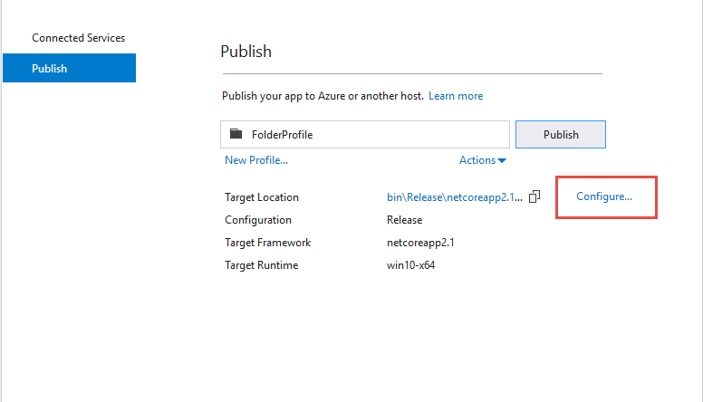
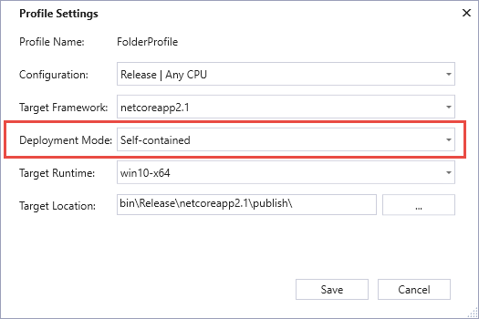

TopShelf service that can be run to demonstrate monitoring for password chagnes via the Application to Application (A2A) functionality in Safeguard.

This is built using the SafeguardDotNet nuget package from nuget.org, not using the source code from the repo.

This sample demonstrates:

- thumbprint-based client certificate authentication from a Windows host (most secure method)
- uses A2A for listening for password changes
- parameters are loaded from app.config
- Serilog logging goes to a console when run interactively and to rolling files when installed as a service


To test the sample:

Configure Safeguard
===================

If you already have a CA cert and SSL client certificate you can use use those. Just replace the thumbprint below with the thumbprint of your client certificate. If not, there are test certificates in the certs folder of the project that you can use to set up the sample:

1. Log in to your Safeguard appliance as a user administrator. Create a new local user called a2a. On the authentication tab select "Certificate" specify the thumbprint: ec1c1c5862471c27925b9c7180eb4facf8398c58 (or your client cert thumbprint). On the permissions tab select "Auditor".
2. Log in to your Safeguard appliance as an appliance administrator and go to Settings -> Certificates -> Trusted Roots and add test-ca.crt (or your own CA cert) as a Trusted Root.
3. Now go to External Integration -> Application to Application. Add a new registration called test. Select the a2a user. Select the  credential retrieval checkbox. On the Credential Retrieval tab select some accounts to monitor for password changes. If there are no accounts, you need to add some accounts first.
 

Configure the Sample A2A Service
================================
1. In Visual Studio, right click the SampleA2aService and select Publish. Click the configure button:



2. Make configure as shown below. Make sure to select Self-contained for the deployment mode. This will produce an executable that you can run as a service.



3. Click the publish button then click the target location link to open the folder where the service was published.

4. Copy the files to the machine where you want to run the service. 

On the machine where you will run the service:

1. Make sure that the dotnet core runtime 2.1 or higher is installed. 
2. Install test.full.pfx (or your own client certificate) to Current User\Personal. The password for the test certificate is test123. Make sure to mark the checkbox for "Mark this key as exportable".
3. Locate the SampleA3aService.dll.config file and modify it as follows: (be sure to specify your safeguard network address and change the thumbprint if you are using your own certificate)
```
<?xml version="1.0" encoding="utf-8"?>
<configuration>
    <appSettings>
        <add key="SafeguardAddress" value="<your network address>" />
        <add key="SafeguardClientCertificateThumbprint" value="ec1c1c5862471c27925b9c7180eb4facf8398c58" />
        <add key="SafeguardApiVersion" value="2" />
        <add key="SafeguardIgnoreSsl" value="true" />
        <add key="LoggingDirectory" value="Logs" />
    </appSettings>
</configuration>
```
4. Start the service from the command line: `SampleA2aService.exe`
